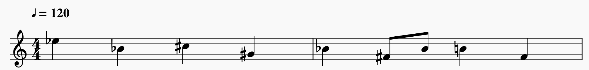

# amuse
An esoteric programming language based on musical notation.

## Building
To build the amuse executable, do the following:

```BASH
$ cabal configure
$ cabal build
```

The built executable can be found in `dist/build/amuse/` or,
alternatively, installed to `$HOME/.cabal/bin/` with:

```BASH
$ cabal install
```

## Usage
Amuse works by reading in [MIDI](https://en.wikipedia.org/wiki/MIDI)
files and executing commands based on the _note_ parsed. The following
table shows what command corresponds to what note.

| Note | Command | Alternate |
|------|---------|-----------|
| C    | Succ    | Pred      |
| C#   | InChar  | InNum  |
| D    | Swap    | NOP       |
| D#   | LoopBegin | Continue |
| E    | Dup     | Over      |
| F    | Drop    | NOP       |
| F#   | LoopEnd | Break     |
| G    | Add     | Sub       |
| G#   | CompareEQ | CompareGT |
| A    | Mult    | Div       |
| A#   | Alternate | NOP     |
| B    | Print   | PrintNum  |

The commands are explained below.

### Add
Adds the top two elements of the stack and pushes the result
to the stack.

E.g. [2, 3, 4] -> [5, 4]

### Alternate
Alternate specifies that the following command should execute its
alternate form.

E.g. Alternate + Note C -> Pred

### Break
Breaks out of a loop and continues execution past the next 
LoopEnd.

### CompareEQ
CompareEQ checks if the top two stack elements are equal. If true,
execution continues normally. Otherwise, execution skips the next
instruction.

### CompareGT
CompareGT checks if the second element of the stack is greater
than the top element of the stack. If true,execution continues
normally. Otherwise, execution skips the next instruction.

E.g. [2, 3, 4] -> true

### Continue
Continue automatically jumps back to the previous LoopBegin.

### Div
Div - Divide - Divides the second element of the stack from the 
first element of the stack.

E.g. [2, 3, 4] -> [3/2, 4]

### Drop
Drops the top element of the stack.

E.g. [2, 3, 4] -> [3, 4]

### Dup
Dup - Duplicate - duplicates the top element of the stack.

E.g. [2, 3, 4] -> [2, 2, 3, 4]

### InChar
InChar - Input Character - awaits user input for a character and
pushes it onto the stack.

### InNum
InNum - Input Number - awaits user input for a number and
pushes it onto the stack.

### LoopBegin
LoopBegin signals the beginning of a loop.

### LoopEnd
LoopEnd signals the end of a loop. Always loops back to the
last LoopBegin.

### Mult
Mult - Multiply - Multiplies the top two elements of the stack and
pushes the result to the top of the stack.

E.g. [2, 3, 4] -> [6, 4]

### NOP
NOP - No Operation - does nothing. Might be reserved for more 
functionality.

### Over
Over pushes a opy of the second element of the stack onto the stack.

E.g. [2, 3, 4] -> [3, 2, 3, 4]

### Pred
Pred - Predecessor - decrements the value of the top of the stack

### Print
Print outputs all of the values in the stack until the NULL 
character: `'\0'`.

### PrintNum
PrintNum - Print Number - prints the raw value of the top element
of the stack.

### Sub
Sub - Subtract - subtracts the top two numbers (first from the 
second) and pushes the result to the top of the stack.

E.g. [2, 3, 4] -> [1, 4

### Succ
Succ - Successor - increments the value of the top of the stack]

### Swap
Swap swaps the top two elements of the stack.

E.g. [2, 3, 4] -> [3, 2, 4]

## Examples
The following program echoes back any number and exits when 0 is
entered.



## TODO
* Implement track switching for sub-program functionality.
* Better error handling.
* Clean up codebase.
* Add more examples.
* Change note bindings based on frequency of use and interval.
* Allow printing without newline
* Change the stack to use numbers instead of characters.